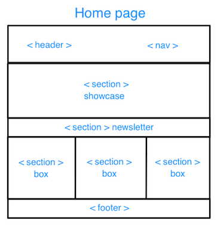
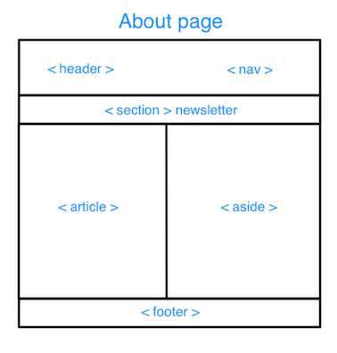
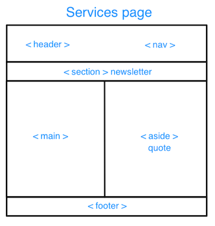

# Development Strategy

> `acme-web-design`

- This project is a simple little website developing with git branches and incremental development.
- This project would interest for novice students of web-development because there is example of applying git branches and incremental development.

## Wireframe

## 0. Set-Up

__A User can see my initial repository and live demo__

### Repo

- Generate from Template
- Write initial, basic README
- Turn on GitHub Pages

## 1. User story: Header and Navigation

### Branches

- This user story was developed on a brach called `1-header-nav`
- It was merged to master when the feature was finished.

### HTML

> This site-block is displayed on each pages. It is the first what see site-visitor. This block should be simple, attractive, understandable and tell to site-visitor where he is and what he could find it.

Add title and meta-tag for SEO.  
Add link for style-css.  
Add header with name of company and navigation in the right-side of header.  
Use minimum text.

### CSS

Use mono color for background of header.   
Use contrast color of font.  
Use hover for navigation.

----

## 2. User story: Showcase

### Branches

- This user story was developed on a brach called `2-showcase`
- It was merged to master when the feature was finished.

### HTML

> This site-block is displayed only on Home-page with aim attract attention and decorate site.

Add section with motto of company and short nice introduction.

### CSS

Add simple foto as background relevant company activities.
Tune contrast font.

----

## 3. User story: Newsletter

### Branches

- This user story was developed on a brach called `3-newsletter`
- It was merged to master when the feature was finished.

### HTML

> This site-block is displayed on each pages. His aim is incite site-visitor to subscribe on news of company.

Add form for subscribe to news with tips in placeholders.   
Add button for form.   
Add short urging head for form.

### CSS

Use contrast font.  
Use mono background.  
Use colorful bright color for button.    

----

## 4. User story: Boxes

### Branches

- This user story was developed on a brach called `4-boxes`
- It was merged to master when the feature was finished.

### HTML

> This site-block is displayed only on Home-page. It should reveal main types of services which company offers. These services must be understandable and remembered.

Add 3 section with 3 type of services.  
Each section consist of logo-page, head and short paragraph.

### CSS

Use contrast font.  
Use colorful outline images for logo-page of services.

----

## 5. User Story: Footer

### Branches

- This user story was developed on a brach called `5-footer`
- It was merged to master when the feature was finished.

### HTML

> This site-block is displayed on each pages. It is needed for confirmation that all information on site owned by company.

Add paragraph about owner of site and copyright.  
Add the year of creation of the site.  

### CSS

Use contrast font.  
Use a little font.  
Use mono color of background in harmony with the overall color scheme.  

----

## 6. User story: About

### Branches

- This user story was developed on a brach called `6-about`
- It was merged to master when the feature was finished.

### HTML

> This branch about the second page of site which call About. On this page site-visitor expect to see some information about company and what she do. This page should be part of overall site.

Create about.html.   
Add html tags, title About and link to css file.  
Copy-paste SEO tag, header, section Newsletter and footer from index.html.  
Add section Main with some nice information about company (about us).  
Add aside element with description what company do.  

### CSS

Highlight with background color the main part of about us.
Highlight and align sidebar.

----

## 7. User story: Services

### Branches

- This user story was developed on a brach called `7-services`
- It was merged to master when the feature was finished.

### HTML

> This branch about the third page of site which call Services. On this page site-visitor expect to see all services of company with descriptions and prices. Also site-visitor should have possibility to send question or make order if some of services will interest him. This page should be part of overall site.

Create services.html.     
Add html tags, title Services and link to css file.  
Copy-paste SEO tag, header, section Newsletter and footer from index.html.  
Add section Main with list of 3 services: head, description, price.    
Add aside element as a form with e-mail and placeholder for message.   

### CSS

Highlight with background color each services in list.  
Highlight and align sidebar-form.

----

## 8. User story: Media queries

### Branches

what branch(es) did you work on?

### HTML

what did you change in the HTML and why?

### CSS

what did you change in the CSS and why?

----

## Finishing Touches

- Write final, complete README
- Validate code to check for any last mistakes
